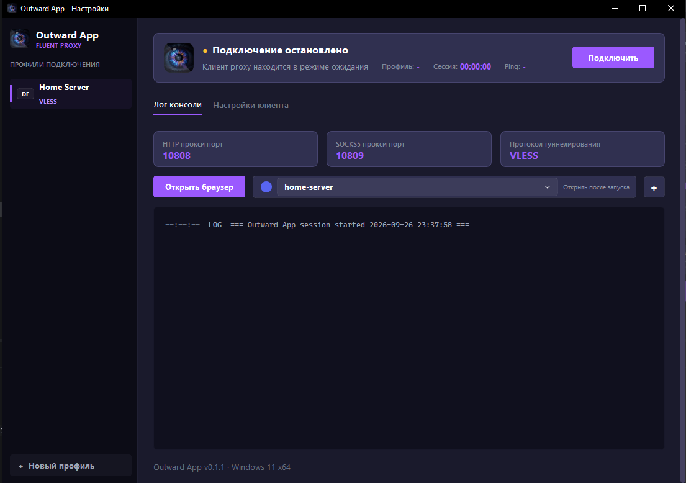
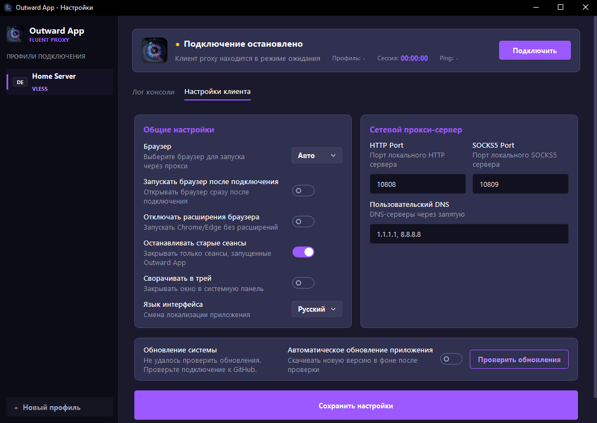

# Outward App

**Language:** [Русский](#русский) | [English](#english)

## Русский

Outward App - Windows-приложение с графическим интерфейсом на базе sing-box, которое открывает разрешенные ресурсы через изолированный локальный proxy и настроенный браузер.

Проект публикуется как source-available приложение под лицензией [PolyForm Noncommercial 1.0.0](LICENSE): код можно читать, изменять, форкать и использовать для личных и других некоммерческих целей. Коммерческое использование требует отдельного письменного разрешения. Визуальные и брендовые материалы лицензируются отдельно: см. [ASSETS-LICENSE.md](ASSETS-LICENSE.md).

### Принцип работы

1. Пользователь добавляет профиль подключения в одном из поддерживаемых форматов sing-box.
2. Приложение проверяет профиль и создает config.json для sing-box.
3. sing-box запускается в фоне и поднимает локальные HTTP и SOCKS5 proxy-порты на 127.0.0.1.
4. Outward App может открыть выбранный ресурс в Google Chrome или Microsoft Edge с примененным SOCKS5 proxy.
5. Пока подключение активно, выбранный ресурс и локальные proxy-порты используют профиль подключения.
6. При отключении приложение останавливает управляемый процесс sing-box.

Если Chrome и Edge не найдены, приложение попробует открыть браузер по умолчанию, но proxy-настройки могут не примениться автоматически.

### Что использует приложение

- Outward App - основное Windows-приложение.
- sing-box - proxy-ядро. В сборке оно упаковывается вместе с приложением.
- Google Chrome или Microsoft Edge - браузер для запуска разрешенного ресурса через proxy.
- Профили подключения - пользовательская конфигурация, из которой собирается конфигурация sing-box.
- Список ресурсов запуска - сохраненные URL, которые можно быстро открыть после подключения.

### Где хранятся данные

Пользовательские данные и runtime-файлы хранятся в %LOCALAPPDATA%\OutwardApp.

В этой папке создаются:

- profiles.json - сохраненные профили подключения.
- settings.json - настройки приложения.
- config.json - последняя сгенерированная конфигурация sing-box.
- sing-box.log - лог запуска и работы proxy-ядра.
- chrome_proxy_profile_<port> - отдельные профили браузера для proxy-запуска.

Эти файлы не должны затираться при обновлении приложения.

### Возможности

- сохранение нескольких профилей подключения;
- поддержка нескольких форматов профилей, совместимых с sing-box;
- выбор страны профиля и автоподсказка страны по ссылке;
- запуск HTTP и SOCKS5 proxy на локальных портах;
- запуск выбранного ресурса через Chrome или Edge;
- управление списком ресурсов для быстрого запуска;
- отдельный браузерный профиль для proxy-сессии;
- настройка URL запуска, DNS, портов, автозапуска браузера и поведения окна;
- темный Windows-first интерфейс на PySide6.

### Техническая совместимость

На текущий момент приложение распознает пользовательские профили VLESS, Shadowsocks и WireGuard и преобразует их в конфигурацию sing-box. Этот раздел предназначен для разработчиков и пользователей, которым нужно понимать формат входных профилей.

### Разработка

    cd "C:\Home Projects\outward-app"
    python -m venv .venv
    .\.venv\Scripts\python.exe -m pip install -r requirements.txt
    .\.venv\Scripts\python.exe -m outward_app

### Тесты

    .\.venv\Scripts\python.exe -m unittest discover -s tests

### Сборка установщика

Перед сборкой установите Inno Setup 6 и зависимости для сборки:

    .\.venv\Scripts\python.exe -m pip install -r requirements-build.txt
    .\install-deps.ps1

`install-deps.ps1` скачивает pinned версию sing-box из `SING_BOX_VERSION` и кладет `bin\sing-box.exe`. Сам бинарник не хранится в Git.

Собрать установщик:

    .\build-installer.ps1

Собрать установщик с конкретной версией:

    .\build-installer.ps1 -Version 0.2.0

Собрать текущую версию без автоматического повышения patch-версии:

    .\build-installer-check.bat

То же самое напрямую через PowerShell:

    .\build-installer.ps1 -NoVersionBump

Перед сборкой пополняйте `release-notes.md` в корне проекта: это исходник описания релиза для текущей версии. Если нужен другой файл, передайте его через `-ReleaseNotesFile`.

После успешной сборки установщик появится в installer-output\Outward App Setup-<version>.exe. Скрипт также создаст SHA256-файл installer-output\Outward App Setup-<version>.exe.sha256 и версионный release notes файл installer-output\release-notes-<version>.md на основе `release-notes.md`.

Обычный релизный поток:

1. Для проверки изменений запустить `build-installer-check.bat`: он соберет установщик без изменения `VERSION`. Для релиза запустить `build-installer.bat`: он повысит patch-версию в `VERSION`.
2. Закоммитить изменения и выполнить `git push`.
3. GitHub Actions увидит изменение `VERSION`, соберет установщик на Windows runner и опубликует GitHub Release `v<version>` с installer и `.sha256`.

Ручная публикация все еще доступна через PowerShell, если установлен GitHub CLI и выполнен `gh auth login`:

    .\build-installer.ps1 -NoVersionBump -PublishRelease

### Как работает

Для проверки новых версий приложение использует GitHub Releases.

При запуске Outward App выполняет фоновую проверку обновлений без блокировки интерфейса. Та же проверка доступна вручную по кнопке Проверить обновления.

Если найдена новая версия, приложение сравнивает номер текущей версии с последним релизом, находит установщик Outward App Setup-<version>.exe и скачивает его в папку updates внутри runtime-директории. Если в релизе указан SHA256 установщика или приложен checksum-файл, скачанный файл проверяется перед запуском.

Когда включено автоматическое обновление приложения, установщик скачивается в фоне. После загрузки Outward App запускает установщик, закрывает текущее окно и дает установщику заменить файлы приложения. После установки запускается обновленная версия.

## English

Outward App is a Windows desktop application that opens permitted resources through a local proxy powered by sing-box and a configured browser.

The project is source-available under the [PolyForm Noncommercial License 1.0.0](LICENSE): you may read, modify, fork, and use the code for personal and other noncommercial purposes. Commercial use requires prior written permission. Visual and brand assets are licensed separately: see [ASSETS-LICENSE.md](ASSETS-LICENSE.md).

### How It Works

1. The user adds a connection profile in one of the supported sing-box-compatible formats.
2. The app validates the profile and creates config.json for sing-box.
3. sing-box starts in the background and opens local HTTP and SOCKS5 proxy ports on 127.0.0.1.
4. Outward App can open the selected resource in Google Chrome or Microsoft Edge with the SOCKS5 proxy applied.
5. While the connection is active, the selected resource and local proxy ports use the connection profile.
6. When disconnected, the app stops the managed sing-box process.

If Chrome and Edge are not found, the app tries to open the default browser, but proxy settings may not be applied automatically.

### What The App Uses

- Outward App - the main Windows application.
- sing-box - the proxy core. Release builds bundle it with the app.
- Google Chrome or Microsoft Edge - the browser used to launch a permitted resource through the proxy.
- Connection profiles - user-supplied configuration used to build the sing-box configuration.
- Launch resources - saved URLs that can be opened quickly after connecting.

### Data Location

User data and runtime files are stored in %LOCALAPPDATA%\OutwardApp.

This folder contains:

- profiles.json - saved connection profiles.
- settings.json - application settings.
- config.json - the latest generated sing-box configuration.
- sing-box.log - proxy core startup and runtime log.
- chrome_proxy_profile_<port> - separate browser profiles for proxy sessions.

These files should not be overwritten during app updates.

### Features

- save multiple connection profiles;
- support multiple sing-box-compatible profile formats;
- select a profile country and infer it from profile data;
- run local HTTP and SOCKS5 proxy ports;
- launch a selected resource through Chrome or Edge;
- manage launch resources for quick access;
- use a separate browser profile for proxy sessions;
- configure the launch URL, DNS, ports, browser autostart, and window behavior;
- dark Windows-first interface built with PySide6.

### Technical Compatibility

The app currently recognizes user-supplied VLESS, Shadowsocks, and WireGuard profiles and converts them into a sing-box configuration. This section is intended for developers and users who need to understand accepted input formats.

### Development

    cd "C:\Home Projects\outward-app"
    python -m venv .venv
    .\.venv\Scripts\python.exe -m pip install -r requirements.txt
    .\.venv\Scripts\python.exe -m outward_app

### Tests

    .\.venv\Scripts\python.exe -m unittest discover -s tests

### Build Installer

Install Inno Setup 6 first, then install build dependencies:

    .\.venv\Scripts\python.exe -m pip install -r requirements-build.txt
    .\install-deps.ps1

`install-deps.ps1` downloads the pinned sing-box version from `SING_BOX_VERSION` into `bin\sing-box.exe`. The binary itself is not stored in Git.

Build the installer:

    .\build-installer.ps1

Build a specific version:

    .\build-installer.ps1 -Version 0.2.0

Build the current version without bumping the patch version:

    .\build-installer-check.bat

The direct PowerShell equivalent is:

    .\build-installer.ps1 -NoVersionBump

Before building, keep `release-notes.md` in the repository root up to date: it is the release description source for the current version. Pass `-ReleaseNotesFile` to use a different source file.

After a successful build, the installer is created in installer-output\Outward App Setup-<version>.exe. The script also creates installer-output\Outward App Setup-<version>.exe.sha256 and a versioned installer-output\release-notes-<version>.md from `release-notes.md`.

Normal release flow:

1. To verify changes, run `build-installer-check.bat`: it builds the installer without changing `VERSION`. For a release, run `build-installer.bat`: it bumps the patch version in `VERSION`.
2. Commit the changes and run `git push`.
3. GitHub Actions sees the `VERSION` change, builds the installer on a Windows runner, and publishes GitHub Release `v<version>` with the installer and `.sha256`.

Manual publishing is still available through PowerShell when GitHub CLI is installed and `gh auth login` has been completed:

    .\build-installer.ps1 -NoVersionBump -PublishRelease

### How It Works

The app uses GitHub Releases to check for new versions.

When Outward App starts, it runs a background update check without blocking the interface. The same check is available manually through the Check for updates button.

When a newer version is available, the app compares the current version with the latest release, finds the Outward App Setup-<version>.exe installer, and downloads it to the updates folder inside the runtime directory. If the release provides the installer SHA256 or a checksum file, the downloaded file is verified before it runs.

When automatic app updates are enabled, the installer is downloaded in the background. After the download finishes, Outward App starts the installer, closes the current window, and lets the installer replace the application files. The updated version starts after installation.

